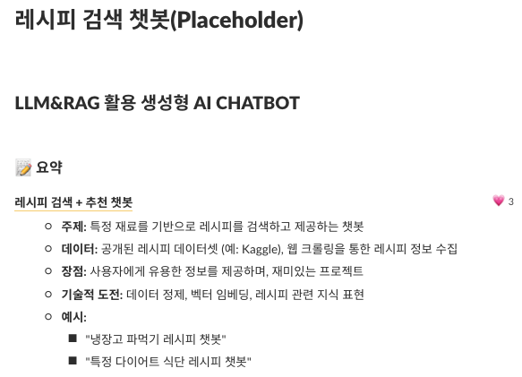
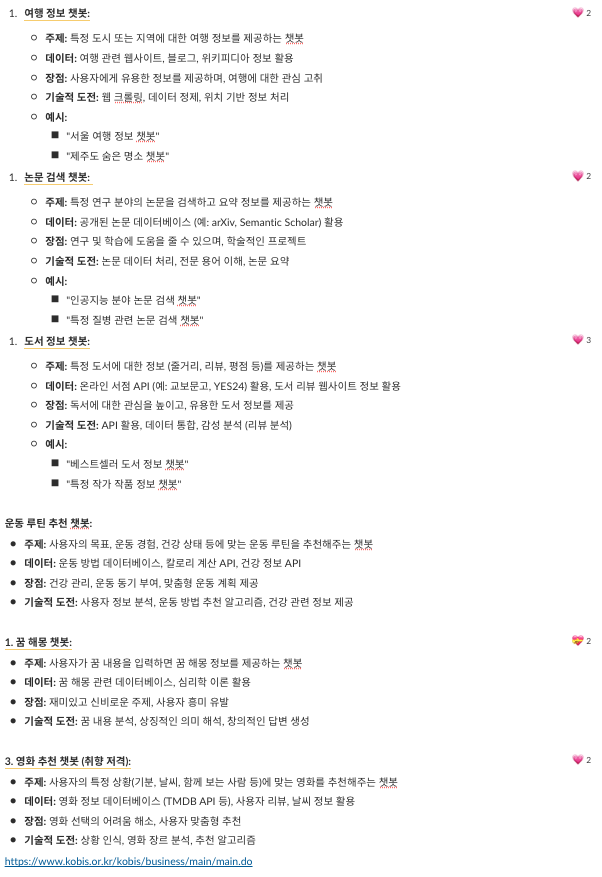
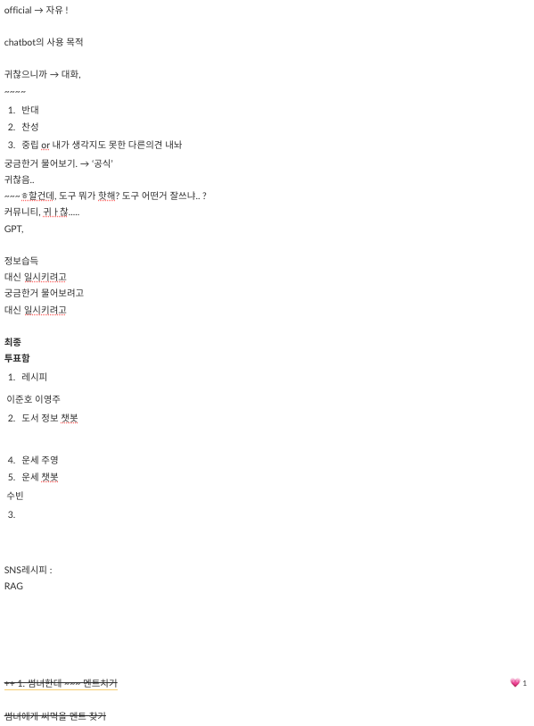
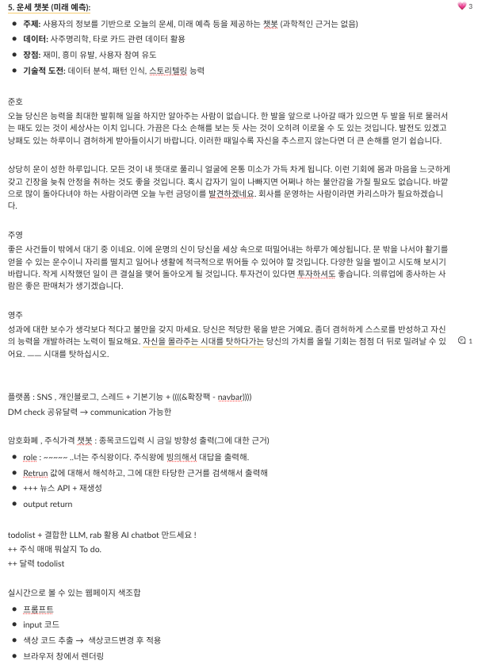
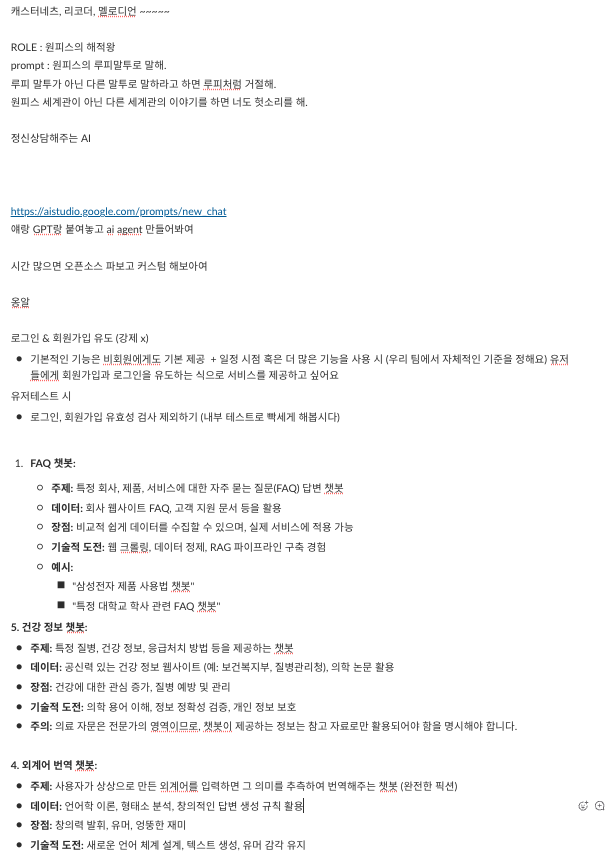
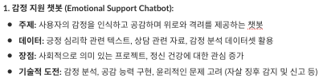

### 2025.02.04 화요일  
   

만들고 싶은 챗봇에 대한 다양한 아이디어가 도출됐다.  
GPT도 도와줬다.  
쟁쟁한 후보들 중 고르고 골라 최종후보가 선출됐고, 그 중에 투표를 통해서 레시피 챗봇을 만들기로 했다.  
05일까지 대충의 workflow와 사용해보고 싶은 도구들, 그리고 관련 데이터셋과 모델들에 대해서 생각해보고 이야기해보기로 했다.  
   

#### 🤖우리가 만들고 싶은 챗봇🤖  
  
##### ✔️최종 후보  
  
######  💡팀내에서 며칠 간 모은 아이디어
  
  
  
  

